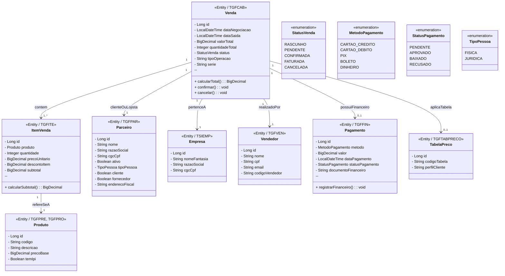

```mermaid
classDiagram
    class Venda {
<<Entity / TGFCAB>>
- Long id
- LocalDateTime dataNegociacao
- LocalDateTime dataSaida
- BigDecimal valorTotal
- Integer quantidadeTotal
- StatusVenda status
- String tipoOperacao
- String serie
--
+ calcularTotal(): BigDecimal
+ confirmar(): void
+ cancelar(): void
}

class ItemVenda {
<<Entity / TGFITE>>
- Long id
- Produto produto
- Integer quantidade
- BigDecimal precoUnitario
- BigDecimal descontoItem
- BigDecimal subtotal
--
+ calcularSubtotal(): BigDecimal
}

class Produto {
<<Entity / TGFPRE, TGFPRO>>
- Long id
- String codigo
- String descricao
- BigDecimal precoBase
- Boolean temIpi
}

class Parceiro {
<<Entity / TGFPAR>>
- Long id
- String nome
- String razaoSocial
- String cgcCpf
- Boolean ativo
- TipoPessoa tipoPessoa
- Boolean cliente
- Boolean fornecedor
- String enderecoFiscal
}

class Empresa {
<<Entity / TSIEMP>>
- Long id
- String nomeFantasia
- String razaoSocial
- String cgcCpf
}

class Vendedor {
<<Entity / TGFVEN>>
- Long id
- String nome
- String cpf
- String email
- String codigoVendedor
}

class Pagamento {
<<Entity / TGFFIN>>
- Long id
- MetodoPagamento metodo
- BigDecimal valor
- LocalDateTime dataPagamento
- StatusPagamento statusPagamento
- String documentoFinanceiro
--
+ registrarFinanceiro(): void
}

class TabelaPreco {
<<Entity / TGFTABPRECO>>
- Long id
- String codigoTabela
- String perfilCliente
}

class StatusVenda {
<<enumeration>>
RASCUNHO
PENDENTE
CONFIRMADA
FATURADA
CANCELADA
}

class MetodoPagamento {
<<enumeration>>
CARTAO_CREDITO
CARTAO_DEBITO
PIX
BOLETO
DINHEIRO
}

class StatusPagamento {
<<enumeration>>
PENDENTE
APROVADO
BAIXADO
RECUSADO
}

class TipoPessoa {
<<enumeration>>
FISICA
JURIDICA
}

Venda "1" --> "1" Empresa : pertenceA
Venda "1" --> "1" Parceiro : clienteOuLojista
Venda "1" --> "1" Vendedor : realizadoPor
Venda "1" --> "1..*" ItemVenda : contem
ItemVenda "1" --> "1" Produto : refereSeA
Venda "1" --> "0..1" Pagamento : possuiFinanceiro
Venda "1" --> "0..1" TabelaPreco : aplicaTabela


```
